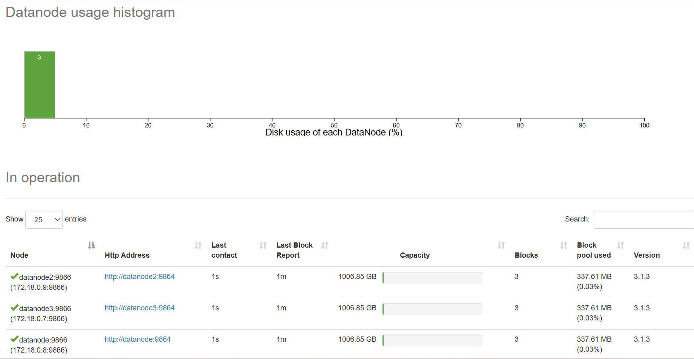
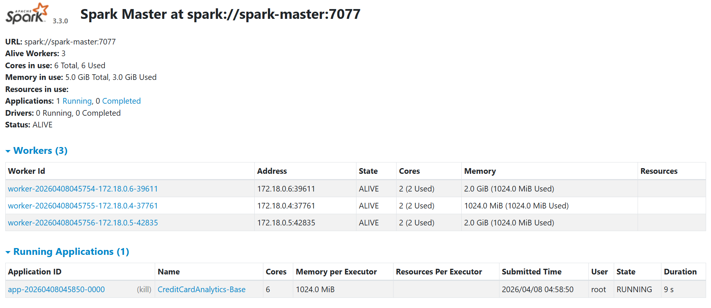
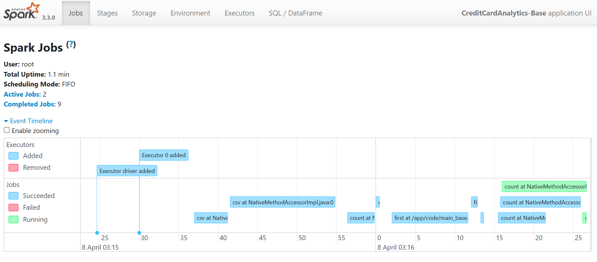
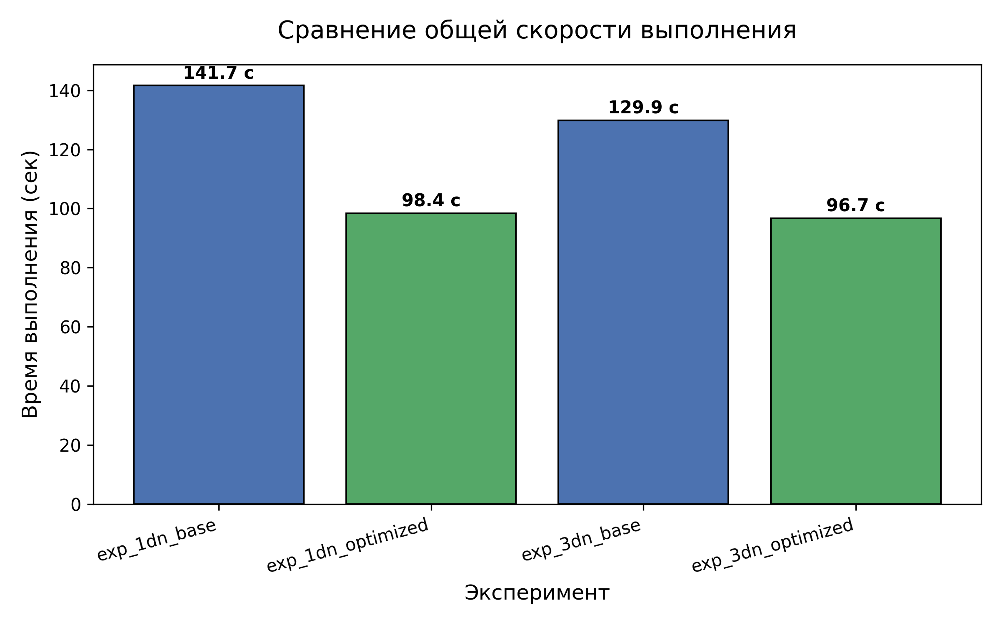
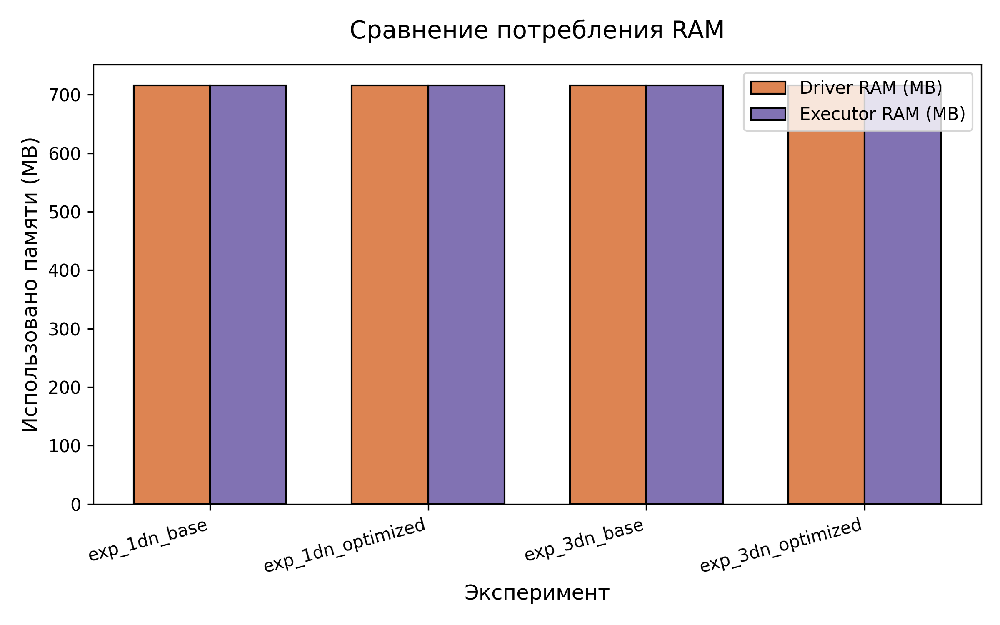
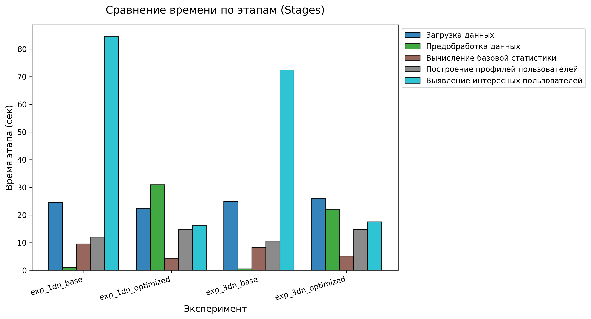

# Лабораторная работа 2. Apache Spark/Hadoop

## Датасет и постановка задачи

### Датасет: [Credit Card Fraud Detection](https://www.kaggle.com/datasets/kaushalnandania/credit-card-fraud-detection?select=train.csv)
- **Объем:** 1,296,675 транзакций
- **Признаков:** 23
- **Категориальные признаки:** 12 (категория, город, род деятельности и др.)

**Цель пайплайна:** Выявить пользователей с нетипичным поведением на основе чистых поведенческих метрик (без использования метки мошенничества).

**Определение "интересных" пользователей:**
- **Высокая частота** - более 5 транзакций в час в среднем
- **Крупные суммы** - средний чек выше 95-го перцентиля всех транзакций
- **Географическая мобильность** - расстояние между пользователем и мерчантом > 150 км
- **Разнообразие категорий** - 10+ уникальных категорий трат
- **Всплески активности** - 5+ транзакций за 10 минут в любой момент

**Выход:** Сравнительный анализ поведения "интересных" и обычных пользователей по категориям, времени суток, географии и сумме.

Более подробный обзор и прототип пайплайна можно найти [здесь](data_analyze.ipynb)

---

## Запуск

### Требования
- Docker и Docker Compose установлены
- Не менее 4 GB свободной оперативной памяти
- Файл `data/train.csv` находится в репозитории

### Запуск всех 4 экспериментов
Скрипт, который выполнит все эксперименты последовательно:
```bash
bash scripts/run_all_experiments.sh
```

Скрипт автоматически:
1. Развертывает Hadoop + Spark кластер (1 или 3 DataNode)
2. Загружает данные в HDFS
3. Запускает Spark приложение (базовое или оптимизированное)
4. Собирает метрики производительности
5. Сохраняет результаты

**Время выполнения:** 15-20 минут на всех 4 экспериментах

### Запуск одного конкретного эксперимента

Если нужно запустить только один эксперимент:

```bash
bash scripts/deploy.sh <config> <optimize>
```

**Параметры:**
- `<config>` — `1dn` (1 DataNode) или `3dn` (3 DataNode)
- `<optimize>` — `0` (базовая версия) или `1` (оптимизированная версия)

**Примеры:**
```bash
# 1 узел, базовая версия
bash scripts/deploy.sh 1dn 0

# 3 узла, оптимизированная версия  
bash scripts/deploy.sh 3dn 1
```

---

## Мониторинг Hadoop и Spark в браузере

Во время работы контейнеров можно открыть в браузере Web UI для мониторинга:

### HDFS NameNode (Hadoop)
- **URL:** http://localhost:9870
- **Что смотреть:** 
  - Статус кластера и DataNodes
  - Использование дискового пространства
  - Количество блоков и их распределение

### HDFS DataNode
- **URL:** http://localhost:9864
  - Для 1-узловой конфигурации (1 DataNode)

### Spark Master UI
- **URL:** http://localhost:8080
- **Что смотреть:**
  - Статус Spark приложений
  - Executors и их ресурсы
  - Logs и timeline выполнения задач

### Spark Application UI
- **URL:** http://localhost:4040
- **Что смотреть:**
  - Детали по Job и Stages
  - Timeline DAG визуализация
  - Статистика по Task выполнению
  - Использование памяти





---

## Результаты экспериментов

### Структура экспериментов
Проведено **4 эксперимента** в комбинации:
- **1 DataNode (1dn):** Базовая (non-optimized) + Оптимизированная версии
- **3 DataNode (3dn):** Базовая (non-optimized) + Оптимизированная версии





### Эксперимент 1: 1dn Base (Базовая версия на 1 узле)
```
Время выполнения: 141.7 сек

Разбор по этапам:
├─ Загрузка данных:                      24.52 сек
├─ Предобработка данных:                  0.92 сек
├─ Вычисление базовой статистики:         9.49 сек
├─ Построение профилей пользователей:   11.98 сек
└─ Выявление интересных пользователей:  84.50 сек

Ресурсы:
└─ Driver: 716 MB / 1024 MB (70%)
└─ Executors: 1 шт., 716 MB / 1024 MB

```

### Эксперимент 2: 1dn Optimized (Оптимизированная версия на 1 узле)
```
Время выполнения: 98.37 сек (↓ 30.6% прирост скорости)

Разбор по этапам:
├─ Загрузка данных:                            22.28 сек
├─ Предобработка данных (с оптимизацией):    30.91 сек
├─ Вычисление базовой статистики:             4.20 сек (↓55.7%)
├─ Построение профилей пользователей:        14.69 сек (+22.5%)
└─ Выявление интересных пользователей:       16.21 сек (↓80.8%)

Ресурсы:
└─ Driver: 716 MB / 1024 MB (70%)
└─ Executors: 1 шт., 716 MB / 1024 MB

Оптимизации:
- Кэширование DataFrame
- Broadcast переменные для больших массивов
- Преломление лишних операций
- Сокращение количества shuffle операций
```

### Эксперимент 3: 3dn Base (Базовая версия на 3 узлах)
```
Время выполнения: 129.88 сек

Разбор по этапам:
├─ Загрузка данных:                      24.97 сек
├─ Предобработка данных:                  0.49 сек
├─ Вычисление базовой статистики:         8.26 сек
├─ Построение профилей пользователей:   10.56 сек
└─ Выявление интересных пользователей:  72.41 сек

Jobs статистика:
├─ Completed jobs:    76
├─ Completed stages:  76
├─ Tasks launched:    649
├─ Tasks completed:   242
└─ Failed tasks:      0

```

### Эксперимент 4: 3dn Optimized (Оптимизированная версия на 3 узлах)
```
Время выполнение: 96.68 сек (↓ 25.6% прирост скорости от базовой 3dn)
Обработано строк: 1,296,675

Разбор по этапам:
├─ Загрузка данных:                            26.01 сек
├─ Предобработка данных (с оптимизацией):     21.92 сек
├─ Вычисление базовой статистики:              5.12 сек (↓38% от 3dn базовой)
├─ Построение профилей пользователей:         14.79 сек (+40% от 3dn базовой)
└─ Выявление интересных пользователей:        17.51 сек (↓75.8% от 3dn базовой)

Ресурсы:
└─ 1 Driver + 3 Executors на разных узлах
└─ Общая память: ~4 GB

Jobs статистика:
├─ Completed jobs:    43 (↓ 43.4% от базовой 3dn)
├─ Completed stages:  44 (↓ 42.1% от базовой 3dn)
├─ Tasks launched:   1248 (↑ 92% от базовой 3dn)
├─ Tasks completed:   332 (↑ 37% от базовой 3dn)
└─ Failed tasks:      0

```

### Сравнительная таблица

| Метрика | 1dn Base | 1dn Opt | 3dn Base | 3dn Opt | Лучший результат |
|---------|----------|---------|----------|---------|------------------|
| **Время выполнения (сек)** | 141.7 | 98.37 | 129.88 | **96.68** | -31.8% vs 1dn Base |
| **Загрузка данных (сек)** | 24.52 | 22.28 | 24.97 | 26.01 | - |
| **Вычисления (сек)** | 94.50 | 35.01 | 91.23 | 37.42 | -79.4% vs 1dn Base |

## Ключевые выводы

### 1. **Эффективность оптимизаций**
- Оптимизированная версия **30.6% быстрее** на 1 узле (`98.37` vs `141.7` сек)
- Оптимизированная версия **25.6% быстрее** на 3 узлах (`96.68` vs `129.88` сек)
- **Более чем в 2 раза быстрее** вычислительная часть (`35.01` vs `94.50` сек на 1dn)

### 2. **Масштабируемость**
- Переход с 1 узла на 3 узла **без оптимизаций**: минимальный выигрыш (-8.4%)
- С **оптимизациями** масштабирование становится эффективнее
- Узкое место в базовой версии — **высокое количество shuffle операций** между узлами

### 3. **Профилирование по этапам**

**Базовая версия (1dn):**
- Доминирует этап выявления интересных пользователей (**84.5 сек = 59.6%** времени)
- Низкое использование оптимизаций Spark

**Оптимизированная версия:**
- Равномерное распределение нагрузки между этапами
- Этап выявления сокращен до **16.21 сек** (1dn) и **17.51 сек** (3dn)
- Кэширование DataFrame и broadcast переменные дали **80.8% ускорение** на критическом пути
